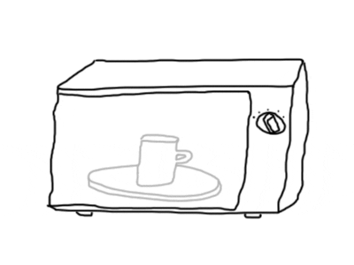
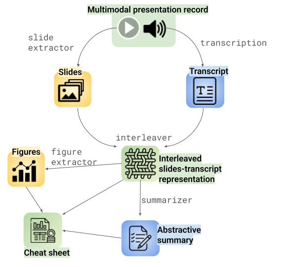

♨️ microwave toolkit: presentations Made Manageable & Memorable with MultiModal Models

A set of tools designed to help you understand and process multimodal presentations using deep learning models. Whether you need to navigate through complex presentations, extract key information, or analyze content, this toolkit provides the tools and features to make presentations more manageable and memorable.

---

[===WIP===]

♨️ Be patient, it's cooking! ♨️

---
# Tools

* [`transcriber`](/transcriber/): automatic speech recognition with word-level timestamps 
* [`slide extractor`](/slide-extractor/): lightweight methods to extract the slides from a video record
* [`interleaver`](/interleaver/): Create and visualize interleaved slides-transcript representation of multimodal presentations

[WIP]
* Generate an abstractive summary
* Extract important slides and figures
* Generate a cheat sheet

