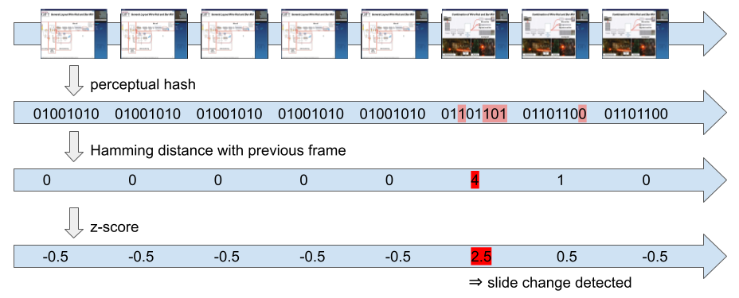

Slide boundaries are estimated from high perceptual hash distances between consecutive frames.


---
# Usage

```python
from extractor import compute_batch_hashes, get_slides

filepath = "" #path to the video file
save_folder = "" #path to the folder where to save the extracted pdf

#compute the hash for each frame and the distances between consecutive frames
h = compute_batch_hashes(filepath)

#extract the slides and save the slidedeck as a pdf
get_slides(filepath, h, save_folder, zscore_threshold=4) #save_imgs=True to save the frames as individual images
```

---
# Citation

If you use this method in your work, you can cite our paper that introduced perceptual hash-based slide extraction from videos:

```
@inproceedings{gigant2023tib,
  title={TIB: A Dataset for Abstractive Summarization of Long Multimodal Videoconference Records},
  author={Gigant, Th{\'e}o and Dufaux, Fr{\'e}d{\'e}ric and Guinaudeau, Camille and Decombas, Marc},
  booktitle={Proceedings of the 20th International Conference on Content-based Multimedia Indexing},
  pages={61--70},
  year={2023}
}
```
